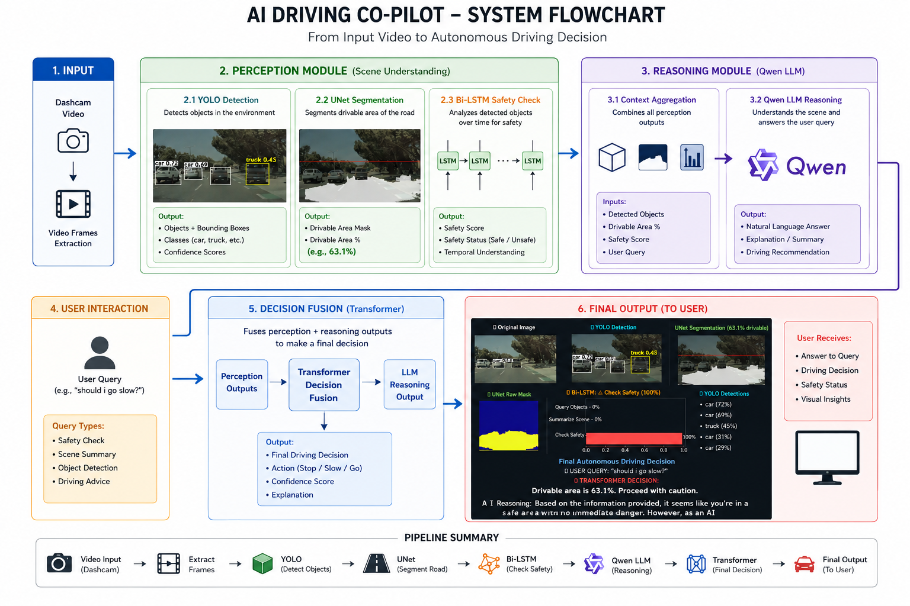
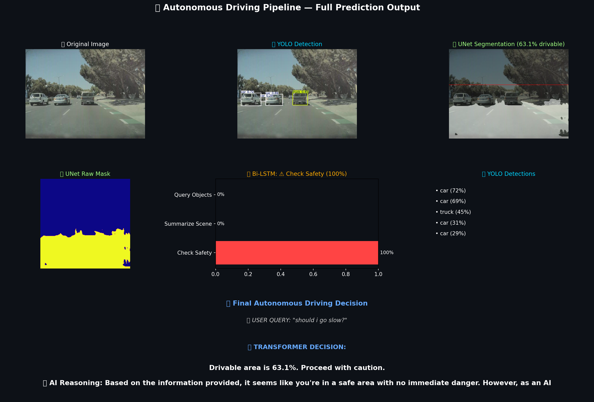
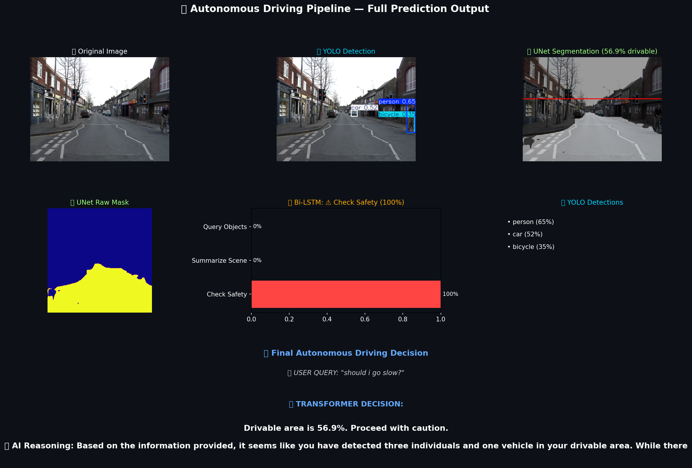

# 🚗 AI Driving Co-Pilot 

A modern, high-performance autonomous driving assistant using FastAPI backend with real-time video processing, object detection, road segmentation, and AI-powered decision making.
## WorkFlow 
<p align="center">
  
</p>
The AI Driving Co-Pilot combines computer vision, intent understanding, and LLM reasoning to provide driving assistance and scene understanding.

---
## 🎯 Features

- **Real-time Webcam Streaming** — Live video feed with YOLO object detection and UNet road segmentation
- **Video Upload & Processing** — Upload driving videos for batch analysis
- **AI-Powered Chat** — Ask questions about the scene using:
  - **Bi-LSTM** — Intent classification (Safety Check, Summarize, Query Objects)
  - **Transformer (Qwen)** — Natural language response generation
- **Performance Optimized** — FastAPI backend with efficient frame processing and threading
- **Modern UI** — Clean, responsive dark-themed interface with real-time telemetry


## 📊 Example Output

<p align="center">
  
</p>

<p align="center">
  
</p>


## 📋 Requirements

- Python 3.9+
- CUDA 11.8+ (for GPU acceleration, optional but recommended)
- 8GB RAM minimum (16GB+ recommended)
- Webcam or video file

## 🚀 Installation

### 1. Clone/Download Project
```bash
cd AI_Car_Assistant
```

### 2. Create Virtual Environment
```bash
python -m venv venv
venv\Scripts\activate  # Windows
source venv/bin/activate  # Linux/Mac
```

### 3. Install Dependencies
```bash
pip install -r requirements.txt
```

**Note**: If you have GPU support, also install:
```bash
pip install torch torchvision torchaudio --index-url https://download.pytorch.org/whl/cu118
```

### 4. Verify Model Files
Ensure these files exist in the project directory:
- `yolo26n.pt` — YOLO detection model
- `custom_scratch_unet.keras` — Road segmentation model
- `bilstm_intent_model/` — Intent classification model (folder)
- `vectorizer_vocab.json` — Text vectorization vocabulary
- `dataset/train/images/` — Contains test image

## 📖 Usage

### Start Backend Server
```bash
python main.py
```

**Expected Output**:
```
INFO:     Uvicorn running on http://0.0.0.0:8000
🚀 Loading models...
✅ All models loaded successfully!
```

### Access Frontend
Open browser and navigate to:
```
http://localhost:8000
```

## 🎮 How to Use

### 1. **Select Video Source**
- **Webcam (Live)**: Real-time streaming from your webcam
- **Upload Video**: Process a pre-recorded video file
- **Test Image**: Use the default test image from dataset

### 2. **Configure Settings**
- **YOLO Size**: Adjust detection resolution (lower = faster, less accurate)
  - 256: Fastest (mobile)
  - 320: Recommended (balanced)
  - 640: Highest quality

### 3. **Monitor Telemetry**
Real-time display of:
- 🗺️ **Drivable Area %** — Road segmentation confidence
- 🔍 **Detected Objects** — YOLO detections with confidence
- 🟢 **Status** — Streaming/Stopped indicator

### 4. **Chat with AI**
- Type a question about the current frame
- Examples:
  - "Is it safe to proceed?"
  - "What objects are around me?"
  - "Summarize the scene"
  - "Are there pedestrians?"

**Response includes**:
- 🧠 **Intent Classification** — Check Safety / Summarize / Query Objects
- 🤖 **AI Decision** — Natural language response from Qwen transformer
- 📊 **Reasoning** — Vision context from YOLO + UNet

## 📁 Project Structure

```
AI_Car_Assistant/
├── main.py                    # FastAPI backend
├── pipeline.py                # Model inference pipeline
├── requirements.txt           # Python dependencies
├── frontend/
│   ├── index.html            # Main web interface
│   ├── style.css             # Styling
│   ├── script.js             # Frontend logic
├── dataset/
│   └── train/images/         # Test images
├── bilstm_intent_model/       # Intent model (TensorFlow SavedModel)
├── yolo26n.pt               # YOLO weights
├── custom_scratch_unet.keras # Road segmentation model
└── vectorizer_vocab.json     # Text vectorizer vocabulary
```

## 🔌 API Endpoints

### Health Check
```
GET /api/status
```
Returns model loading status.

### Webcam
```
POST /api/webcam/start
GET /api/webcam/frame?imgsz=320
POST /api/webcam/stop
```

### Video Upload
```
POST /api/video/upload
```
Accepts video file and processes all frames.

### Chat
```
POST /api/chat
Body: {"query": "Is it safe?"}
```
Processes user query on current frame.

## ⚙️ Configuration

Edit `pipeline.py` `CONFIG` section:

```python
CONFIG = {
    "yolo_model_path":      "yolo26n.pt",
    "unet_model_path":      "custom_scratch_unet.keras",
    "bilstm_model_path":    "bilstm_intent_model.keras",
    "transformer_path":     "Qwen/Qwen2.5-0.5B-Instruct",
    "test_image_path":      "dataset/train/images/13_013_jpg.rf.1920fe478d505d08d8eb5e96c80c2260.jpg",
    "unet_input_size":      (256, 256),
    "bilstm_max_len":       15,
    "bilstm_num_classes":   3,
}
```

### Class Labels (Bi-LSTM Intent)
```python
BILSTM_CLASS_MAP = {
    0: ("Check Safety",     "⚠️"),
    1: ("Summarize Scene",  "🔍"),
    2: ("Query Objects",    "🎯"),
}
```

## 🐛 Troubleshooting

### Backend Won't Start
```
❌ Error: Port 8000 already in use
```
**Solution**: Change port in `main.py`:
```python
uvicorn.run(app, host="0.0.0.0", port=8001)  # Use different port
```

### Webcam Not Working
```
❌ Cannot open webcam
```
**Solutions**:
- Check camera permissions (Windows: Settings → Privacy → Camera)
- Ensure no other app is using webcam
- Try: `python -c "import cv2; cap = cv2.VideoCapture(0); print('OK' if cap.isOpened() else 'FAIL')"`

### CUDA/GPU Issues
```
❌ RuntimeError: CUDA out of memory
```
**Solution**: Use CPU mode (slower but works):
```python
# In main.py, comment out GPU line:
phi3 = AutoModelForCausalLM.from_pretrained(
    cfg["transformer_path"],
    # device_map="cuda",  # ← Comment this
    torch_dtype=torch.float16,
)
```

### Models Not Found
```
❌ FileNotFoundError: 'yolo26n.pt' not found
```
**Solution**: Ensure all model files are in project root:
- `yolo26n.pt` — Download from Ultralytics
- `custom_scratch_unet.keras` — Your trained UNet
- `bilstm_intent_model/` — Your trained model folder
- `vectorizer_vocab.json` — Generated during training

### Slow Video Processing
**Solutions**:
1. Lower YOLO size (256 or 320)
2. Disable UNet overlay temporarily
3. Use GPU (install CUDA)
4. Reduce frame rate from 10 FPS → 5 FPS in `script.js`

## 🎨 Customization

### Change UI Colors
Edit `frontend/style.css`:
```css
/* Change primary color from cyan (#00d4ff) to your color */
.header h1 {
    background: linear-gradient(135deg, YOUR_COLOR_1, YOUR_COLOR_2);
}
```

### Adjust Frame Rate
In `frontend/script.js`:
```javascript
// Change 100 (10 FPS) to different interval
webcamFrameInterval = setInterval(fetchWebcamFrame, 100);
```

### Add More Intent Classes
1. Update `bilstm_num_classes` in `CONFIG`
2. Add entries to `BILSTM_CLASS_MAP` in `pipeline.py`
3. Retrain Bi-LSTM model

## 📊 Performance Tips

1. **GPU Acceleration** — Install CUDA for 3-5x speedup
2. **Lower YOLO Resolution** — Use 320 instead of 640
3. **Reduce Frame Rate** — Adjust interval from 100ms → 200ms
4. **Batch Upload** — Process multiple frames efficiently
5. **Model Quantization** — Use FP16 instead of FP32

## 🔗 Deployment

### Using Gunicorn (Production)
```bash
pip install gunicorn
gunicorn -w 4 -b 0.0.0.0:8000 main:app
```

### Using Docker
```dockerfile
FROM python:3.9-slim
WORKDIR /app
COPY requirements.txt .
RUN pip install -r requirements.txt
COPY . .
CMD ["uvicorn", "main:app", "--host", "0.0.0.0", "--port", "8000"]
```

## 📝 License

This project uses pre-trained models from:
- Ultralytics YOLO
- TensorFlow/Keras
- Hugging Face Transformers (Qwen)

See respective licenses for terms.

## 📞 Support

- Check logs in terminal for error messages
- Verify all model files exist
- Ensure Python 3.9+ compatibility
- Test webcam with: `python -c "import cv2; cv2.VideoCapture(0)"`

---

**Happy driving! 🚗✨**
